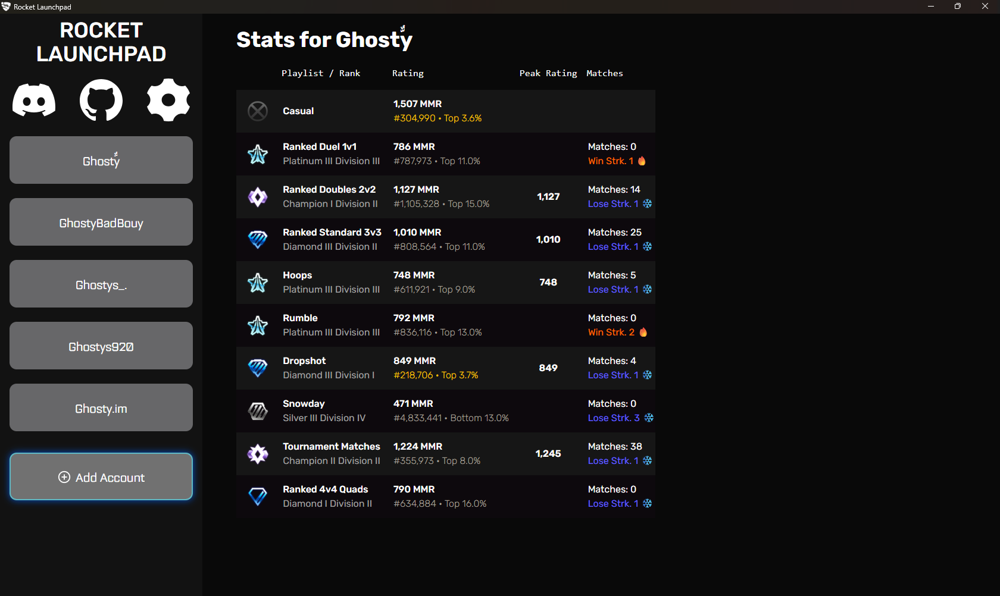
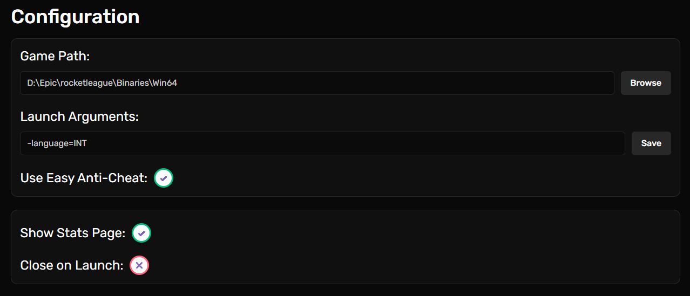
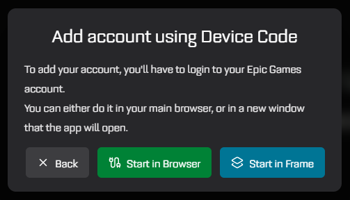
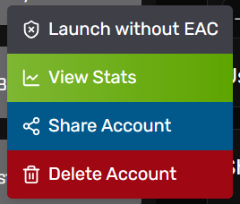

# Rocket Launchpad

[](https://github.com/Ghosty920/RocketLaunchpad/releases/latest)

[](https://github.com/Ghosty920/RocketLaunchpad/stargazers)
[](https://github.com/Ghosty920/RocketLaunchpad/forks)

[](https://github.com/Ghosty920/RocketLaunchpad/commits)
[](https://github.com/Ghosty920/RocketLaunchpad/commits)
[](https://github.com/Ghosty920/RocketLaunchpad/issues)

Rocket Launchpad is a simple Rocket League launcher that makes it easy to start the game with or without Easy Anti-Cheat, switch between multiple accounts, and check stats in one click.



## Configuration and Account Management

Open the config page with the settings wheel.



Add an account with the `(+) Add Account` button on the left.

Log in with Device Code (Epic Games) or use a Share Code if someone shared an account with you.



Once you log in, the account shows up on the left.

Left-click an account to launch the game or open the Stats page (if enabled). If it did not start the first time, click again.

Right-click for quick actions: launch with or without EAC, open stats, share the account, or delete it.



## Development

[](https://github.com/Ghosty920/RocketLaunchpad/actions)
[](https://github.com/Ghosty920/RocketLaunchpad/blob/master/LICENSE)

If you want to contribute, here is the quick setup:

```bash
# Clone the repo
git clone https://github.com/Ghosty920/RocketLaunchpad # or your fork
cd RocketLaunchpad
# Install dependencies
pnpm install
# Optionally, also install for Rust (it'll be done at build time anyway)
cd src-tauri && cargo install --path .
```

To run it:

```bash
pnpm tauri dev # Opens the program and auto-updates on change
pnpm tauri build # Makes a release
```

Please validate and format before pushing ^^.

```bash
pnpm validate
pnpm format
```

### Stats Menu

Stats data comes from [tracker.gg](https://rocketleague.tracker.network/). I am not responsible for your usage of it.
